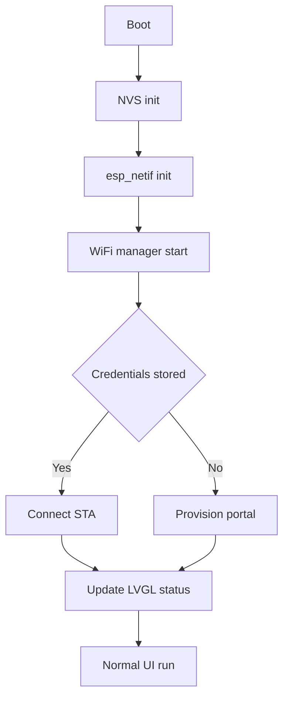

# Wi-Fi Manager Integration Plan for JC3248W535EN Demo

## Context
- Current firmware targets ESP-IDF 5.3 via [platformio.ini](../platformio.ini:22).
- Wi-Fi stack is compiled but unused; see [DEMO_LVGL.c](../src/DEMO_LVGL.c:49) for the existing UI flow.
- Target Wi-Fi provisioning component: https://github.com/tonyp7/esp32-wifi-manager.

## A. Repository Intake
1. Add the esp32-wifi-manager source as a git submodule or vendor drop under components/wifi_manager, preserving upstream structure (CMakeLists.txt, Kconfig, include/, src/, resources/).
2. Ensure portal assets (HTML/CSS/JS) remain in the component so the embedded HTTP server serves the captive portal correctly.

## B. Build-System Updates
3. Add extra_components_dirs = components to [platformio.ini](../platformio.ini:33) so PlatformIO picks up custom ESP-IDF components.
4. Review existing build flags (e.g., -D LOG_LOCAL_LEVEL=ESP_LOG_VERBOSE) and add any defines required by esp32-wifi-manager.

## C. Configuration Baselines
5. Extend [sdkconfig.defaults](../sdkconfig.defaults:1) with Wi-Fi manager prerequisites such as CONFIG_HTTPD_WS_SUPPORT, CONFIG_HTTPD_MAX_REQ_HDR_LEN, CONFIG_WIFI_PROV_SEC_PSK (if desired), and confirm Wi-Fi/NVS/TLS flags already present in [sdkconfig.LVGL-320-480](../sdkconfig.LVGL-320-480:1102).
6. Regenerate sdkconfig via pio run -t menuconfig or by editing defaults to ensure new options compile without conflicts.

## D. Initialization Wrapper
7. Create src/wifi_manager_wrapper.c and src/wifi_manager_wrapper.h to:
   - Initialize NVS (nvs_flash_init), esp_netif, and the default event loop.
   - Start wifi_manager_start and retain handles for event callbacks.
   - Expose a blocking helper (wifi_manager_wait_for_connection) that waits on a FreeRTOS event group signaled when STA gets an IP.
8. Register callbacks inside the wrapper to translate wifi_manager events into PROVISIONING/CONNECTING/ONLINE/FAIL messages pushed through a thread-safe queue for LVGL.

## E. LVGL Integration
9. Update setup() in [DEMO_LVGL.c](../src/DEMO_LVGL.c:49) to invoke the wrapper before bsp_display_start_with_config, optionally timing out to allow offline UI if Wi-Fi is unavailable.
10. Build LVGL status widgets (banner or modal) that consume the queue and use bsp_display_lock/bsp_display_unlock around LVGL mutations.
11. Add a visual control (e.g., long-press gesture) that calls wifi_manager_reset_settings so users can re-enter provisioning mode.
12. On teardown paths, unsubscribe callbacks and stop the manager if the firmware supports graceful shutdown.

## F. Documentation and Testing
13. Document provisioning workflow, new configuration flags, and captive portal usage in [README.md](../README.md:1).
14. Validation sequence:
   - Build with pio run -e LVGL-320-480 and resolve any build issues.
   - On first boot, verify captive portal provisioning, credential storage in NVS, and successful STA connection.
   - Test persistence across reset and reconnection after AP outage.
   - Run LVGL demo to ensure UI remains responsive alongside Wi-Fi tasks.

## Flow Overview

## Next Actions
- Follow the checklist above in order, updating the project TODO list as each item completes.